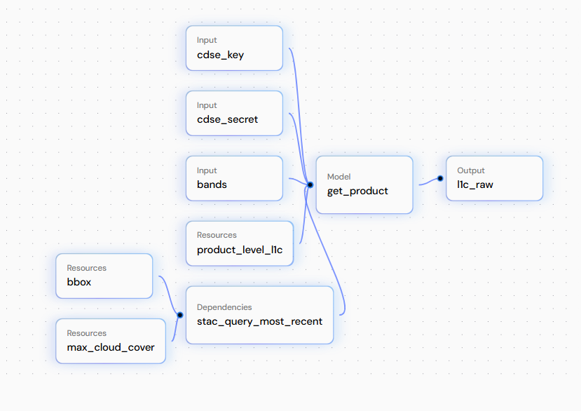

## How to use

This DeltaTwin Model implements a pipeline to retrieve the most recent Sentinel-2 L2A and L1C matching pair. 
It returns the image for the selected bands. The result workflow is the following one:




### Test GET-PRODUCT-S2

To test it locally, please run the following command:

Go to the folder holding main.py

```bash
cd get-product-S2-integrated/models
```
Run 
```bash
python main.py cdse_key cdse_secret bands

e.g:
python main.py your_cdse_key your_cdse_secret "B02,B03,B04"
```

To ask for help: 

```bash
cd get-product-S2-integrated/models

python main.py --help

```
### Test DeltaTwin locally

To test the module locally, run:

Go to the main get-product-S2-integrated folder, containing: manifest.json, workflow.yml, models/, inputs_file.json

```bash

deltatwin run start_local -i inputs_file.json --debug
```

### Publish Delta Twin

1. Make Sure you have login beforehand:
```bash
deltatwin login -a https://api.deltatwin.destine.eu/ username password 
```